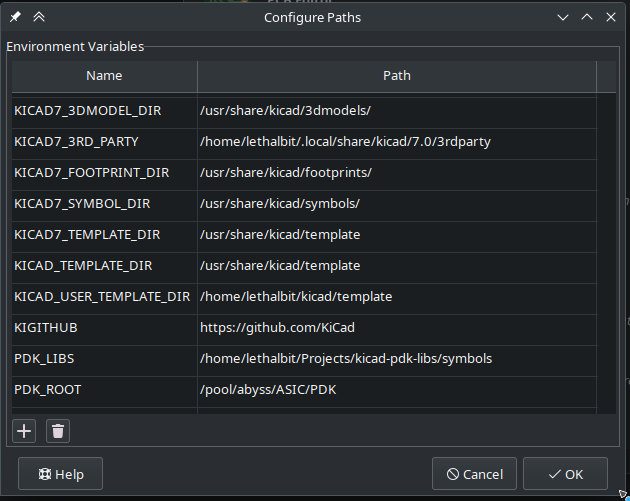

# KiCad-PDK-Libs: Installing

> [!NOTE]
> Currently this is not in the [KiCad] [PCM], so you need to install it manually, but it's not particularly hard to do.

### Manually Installing

First, clone this repository to the place you wish to keep it

```
$ git clone https://github.com/lethalbit/kicad-pdk-libs
```

Next, Open KiCad and go to `Preferences` -> `Manage Paths`, it is recommended you use the path variable `PDK_LIBS` for the path to the kicad-pdk-libs. It is required to use `PDK_ROOT` to point to the location where your [open_pdk] installs are as that is used to ensure SPICE library linkage.




Once that is done, go to `Preferences` -> `Manage Symbol Libraries` and add the symbols from the PDK you wish to. For `sky130A` and `sky130B` only the base cell libraries are really recommended at the moment.

| Active             | Visible            | Nickname            | Library Path                                      |
|--------------------|--------------------|---------------------|---------------------------------------------------|
| :heavy_check_mark: | :heavy_check_mark: | `sky130_fd_sc_hd`   | `${PDK_LIBS}/sky130B/sky130_fd_sc_hd.kicad_sym`   |
| :heavy_check_mark: | :heavy_check_mark: | `sky130_fd_sc_md`   | `${PDK_LIBS}/sky130B/sky130_fd_sc_md.kicad_sym`   |
| :heavy_check_mark: | :heavy_check_mark: | `sky130_fd_sc_hs`   | `${PDK_LIBS}/sky130B/sky130_fd_sc_hs.kicad_sym`   |
| :heavy_check_mark: | :heavy_check_mark: | `sky130_fd_sc_ls`   | `${PDK_LIBS}/sky130B/sky130_fd_sc_ls.kicad_sym`   |
| :heavy_check_mark: | :heavy_check_mark: | `sky130_fd_sc_hdll` | `${PDK_LIBS}/sky130B/sky130_fd_sc_hdll.kicad_sym` |
| :heavy_check_mark: | :heavy_check_mark: | `sky130_fd_sc_hvl`  | `${PDK_LIBS}/sky130B/sky130_fd_sc_hvl.kicad_sym`  |


Once that is done ensure they show up when you try to add a part to eeschema, and you should be good to go!

[KiCad]: https://www.kicad.org/
[open_pdk]: https://github.com/RTimothyEdwards/open_pdks
[PCM]: https://www.kicad.org/pcm/
