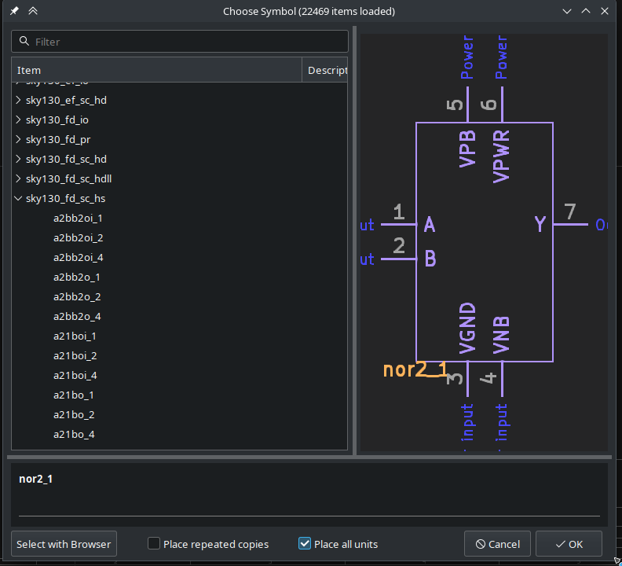
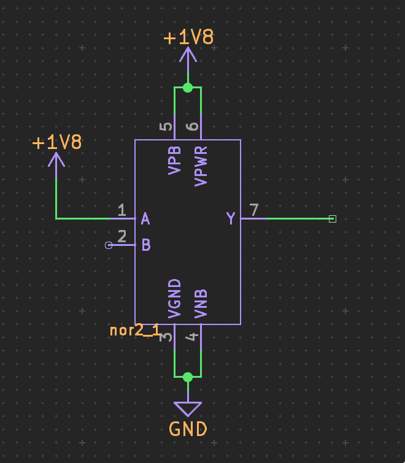
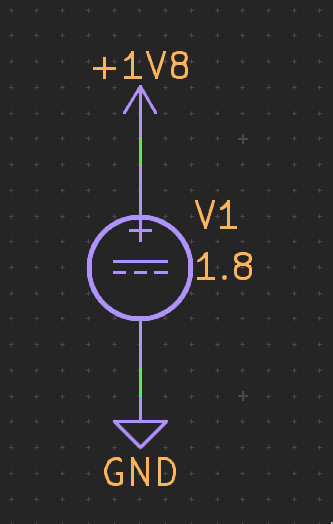
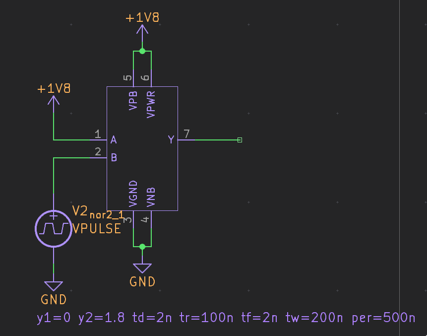
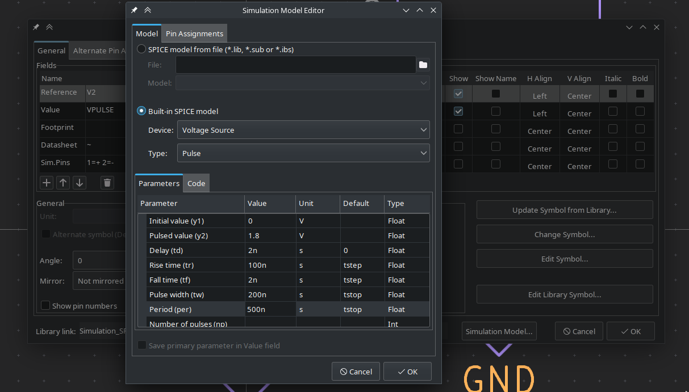
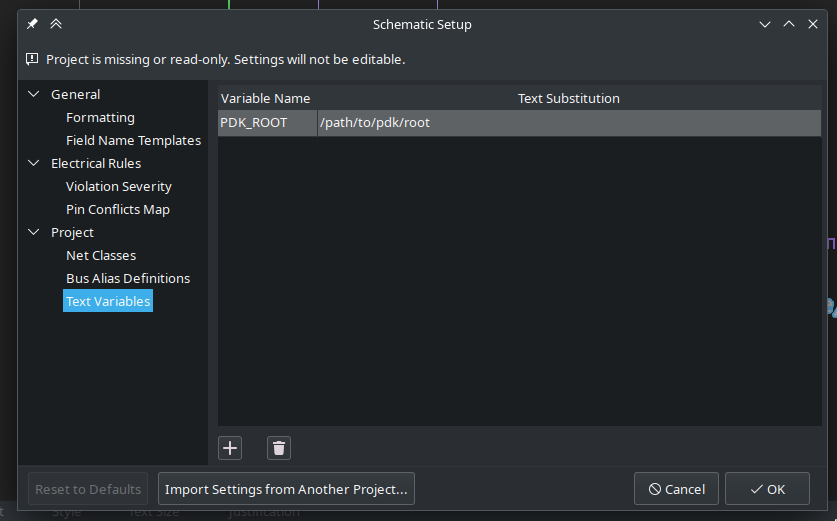
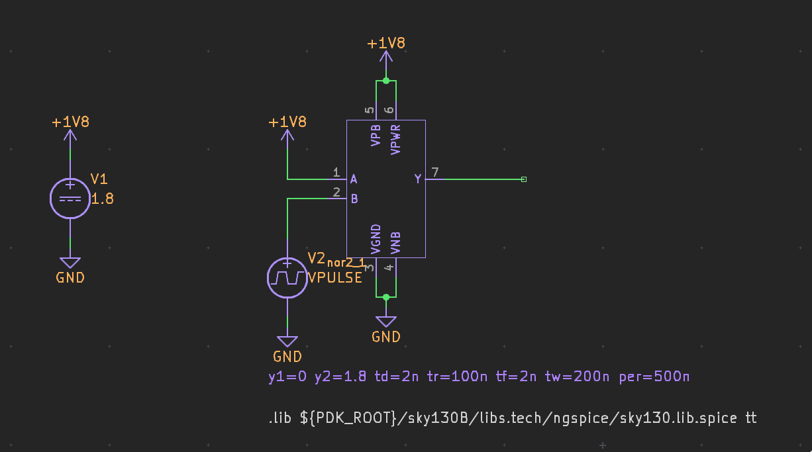
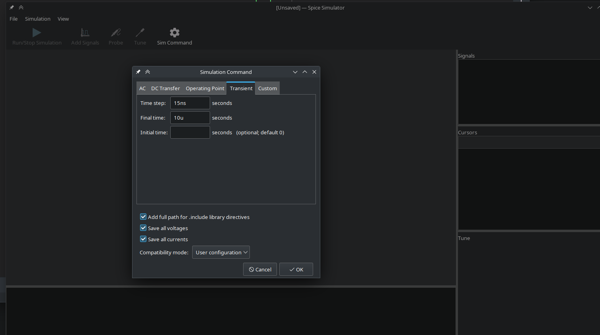
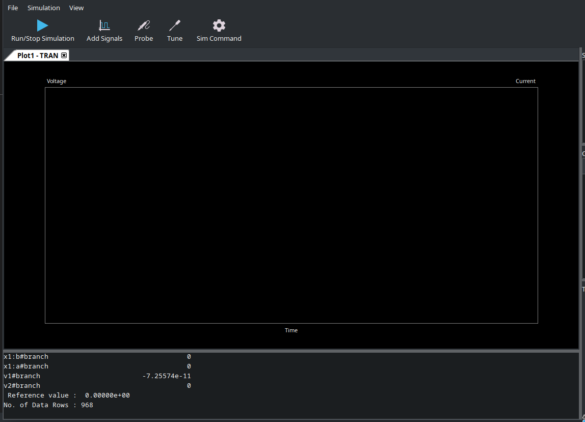
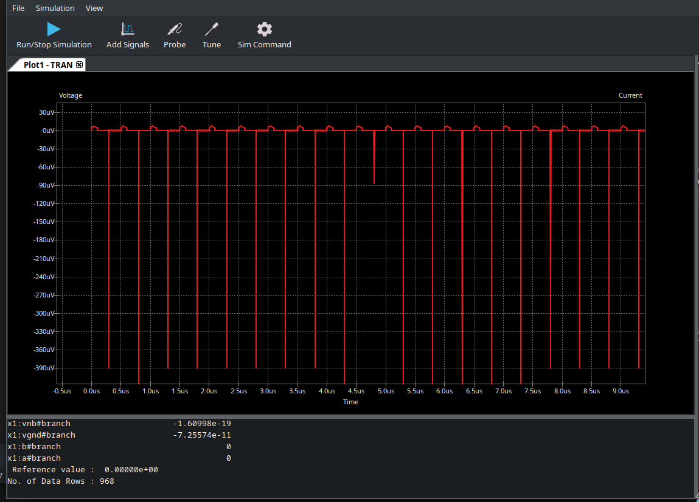

# KiCad-PDK-Libs: Introductory Usage

> [!NOTE]
> This document might not be complete, if you have any issues raise an issue.

Once you've followed the [installation](./install.md) steps, you can start using the symbol library right away!

This document will walk you through a quick example to get you started.

First, open a new eeschema instance, this can be done standalone or via the KiCad main window.

With a fresh schematic document open, find the `sky130_fd_sc_hs` library, we will be using the `nor2_1` standard cell from it.

Place that down on the sheet, followed by hooking up the GND and power ports with the standard KiCad symbols, in this case we're using `+1V8` as that's the nominal supply voltage for the process.

We also add a pull up to VCC on the A input and an empty wire on the Y output for probing.

Next, add a `VDC` SPICE element from the KiCad libraries and change it's value to `1.8`, hooking it up to `+1V8` and `GND` appropriately.

Now we want to add a `VPULSE` SPICE symbol to stimulate the input of our NOR cell. hooking the positive output up to the B input and the bottom to GND.

Now we need to edit the SPICE params of the `VPULSE` symbol to put it in the right range, and adjust the rise and fall times. Hover over the symbol and press <kbd>E</kbd> to open the properties an then click the button on the bottom left labeled `Simulation Model`. This will open up a window that lets us edit the SPICE model parameters.

Here we set the pulsed value to `1.8` the Rise time to `100n` and the pulse width to `200n` with a Period of `500n`. Hit okay on the model editor then okay on the symbol properties.

Finally we need to link in the sky130 transistor models SPICE library. this is done by placing a special text element in the schematic with a `.lib` spice directive.

For this example we use `.lib ${PDK_ROOT}/sky130B/libs.tech/ngspice/sky130.lib.spice tt`, this tells the SPICE engine to look at `${PDK_ROOT}/sky130B/libs.tech/ngspice/sky130.lib.spice` for the spice library and use the `tt` model.

There are a few possible simulation models you can use, primarily `ss`, `tt`, and `ff` which represent the worst, average, and best case process models.

Next, we need to set `PDK_ROOT` as a eeschema variable so the text substitution works appropriately. To do this, go to `File` -> `Schematic Setup`, then under `Project` select `Text Variables`, add a new entry with `PDK_ROOT` as the variable name, and the appropriate path.

When all is said and done, your schematic should look like this.

Now we are ready to run the simulation! Click the `Simulate Circuit in SPICE` button on the toolbar to open the Simulation window.

When the Spice Simulator is open, click on the `Sim Command` button, this will let us set up the simulation parameters. Under the `Transient` tab, enter `15n` for the `Time step` and `10u` for the Final time, then click okay.

When that's done, the `Run/Stop Simulation` button should be enabled, Click it to run the simulation. It will take a few seconds to start up as it loads the transistor models for the PDK and runs the simulation.

Once it's done, you'll get an empty looking graph, and output in the console like so:

Once it is done, click on the `Probe` button and select the wire in eeschema that is coming out of the `Y` port on the `not2_1` cell. You should see the results on the graph.

And there you go! You ran your first SPICE simulation using the sky130 PDK in KiCad!
