# KiCad-PDK-Libs: Your First CMOS Inverter

> [!NOTE]
> This document might not be complete, if you have any issues raise an issue.

This introduction will walk you though setting up your first KiCad schematic for simulating a sky130 CMOS inverter!

First, make sure you've followed the [installation](./install.md) steps to make sure the PDK symbol library is ready for you  to use.

Once you're all set up, open a blank schematic, this can be done as part of a project in KiCad, but I recommend for this to just start `eeschema` standalone for this.

## Setting Up The Inverter

With the blank schematic open, we first need to add a few symbols, in this case we will be using the `sky130_nfet_01v8` and the `sky130_pfet_01v8` symbols, which are the primitive parasitized FET models.

So, hit `a` on your keyboard to add a new symbol, and search for the appropriate FET symbols, like so:

<table>
	<tbody>
		<tr>
			<td>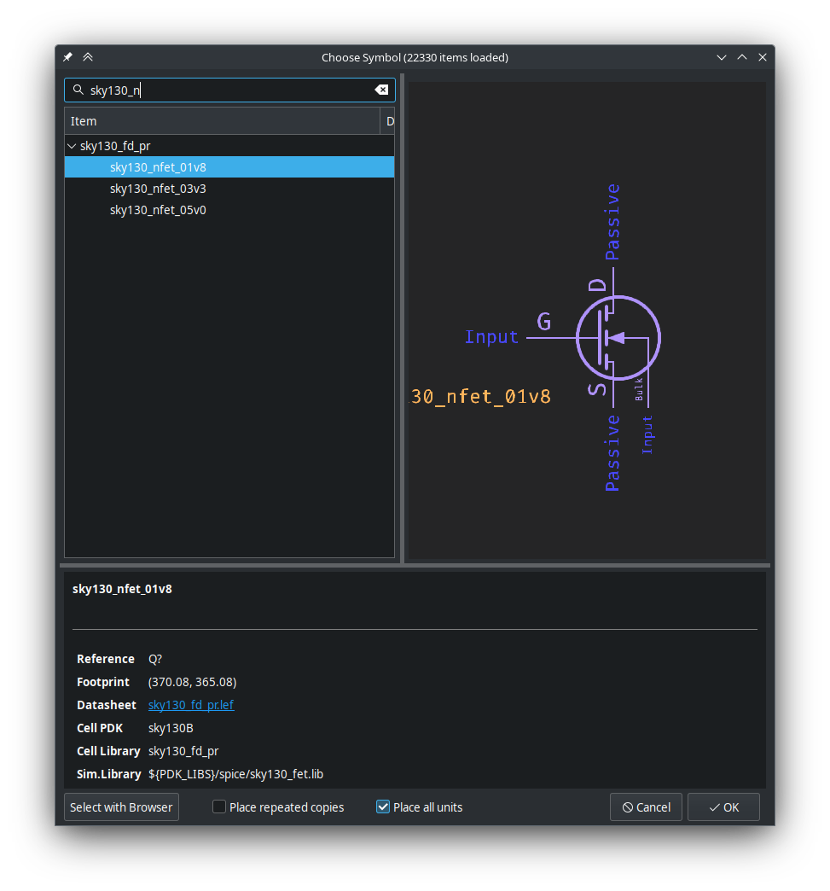</td>
			<td>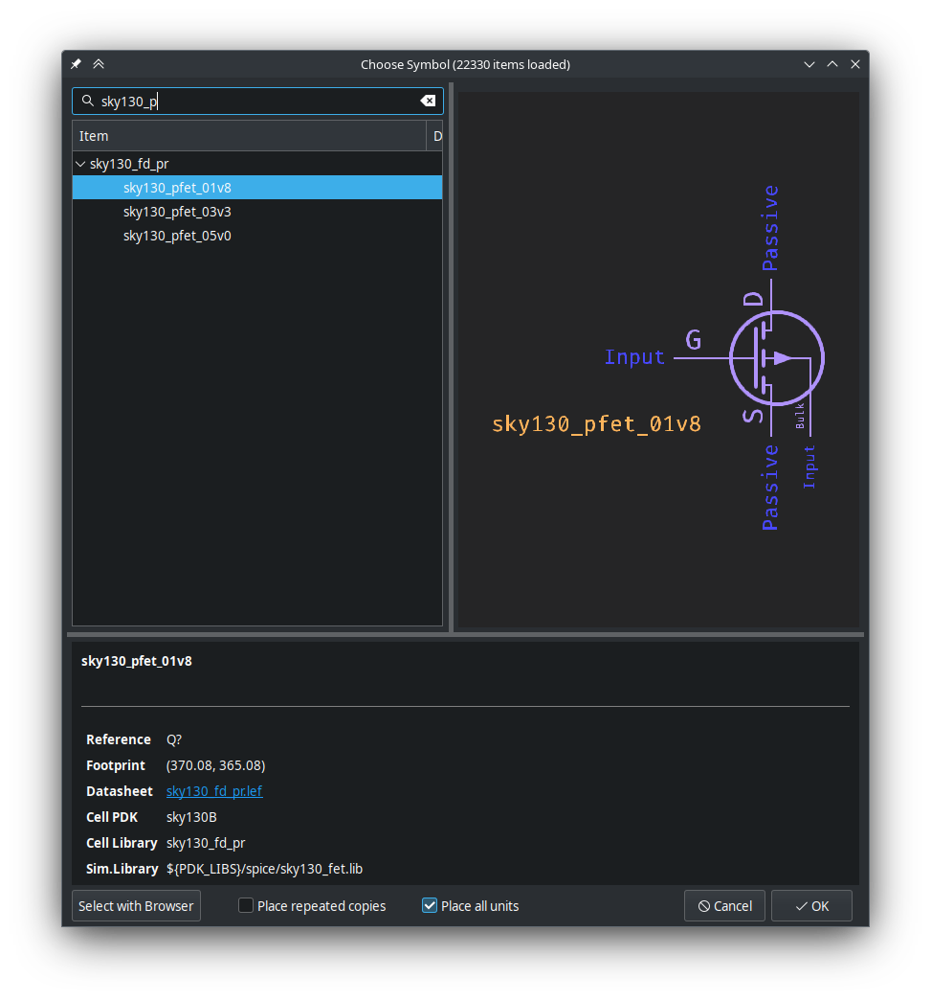</td>
		</tr>
	</tbody>
</table>


As we're making a simple CMOS inverter, ensure the PFET is above the NFET, and both of the drains of each FET are facing each other, like so:

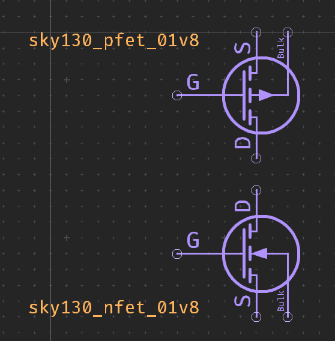


Next, wire the gates and drains together, putting the net label `A` on the gate net, and the net label `Y` on the drain net:

<table>
	<tbody>
		<tr>
			<td>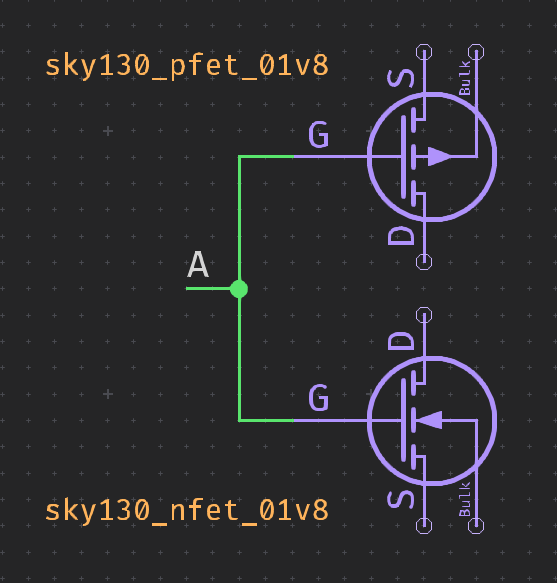</td>
			<td>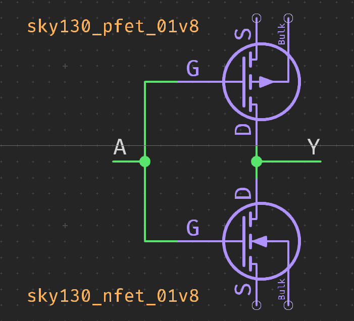</td>
		</tr>
	</tbody>
</table>


Now, we need to hook up the power, add a `VCC` symbol connected to the source and bulk of the PFET and a `GND` symbol connected to the source and bulk of the NFET, as shown below:

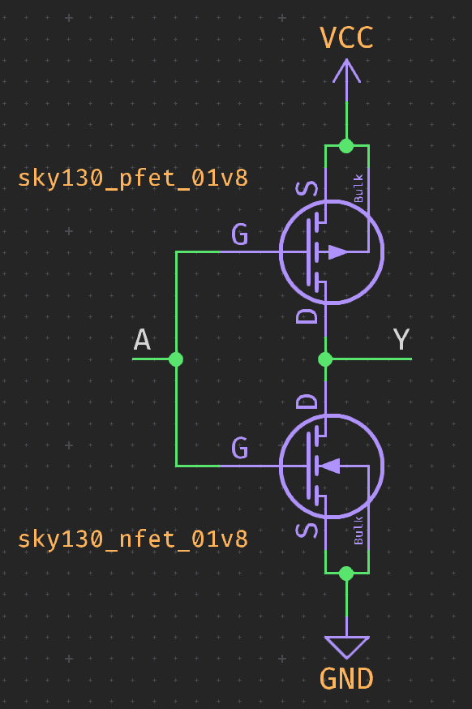

## Support Symbols

Next we need to add some SPICE simulation elements to help drive our inverter, we're looking for the `VDC` and `VPULSE` symbols from the `Simulation_SPICE` library in KiCad.

The `VDC` symbol will provide a voltage source to the netlist, where as the `VPULSE` symbol will drive the inverter so we can properly simulate it and ensure it's working.

<table>
	<tbody>
		<tr>
			<td>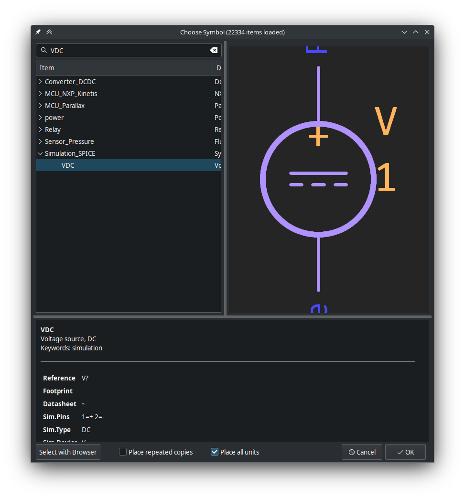</td>
			<td>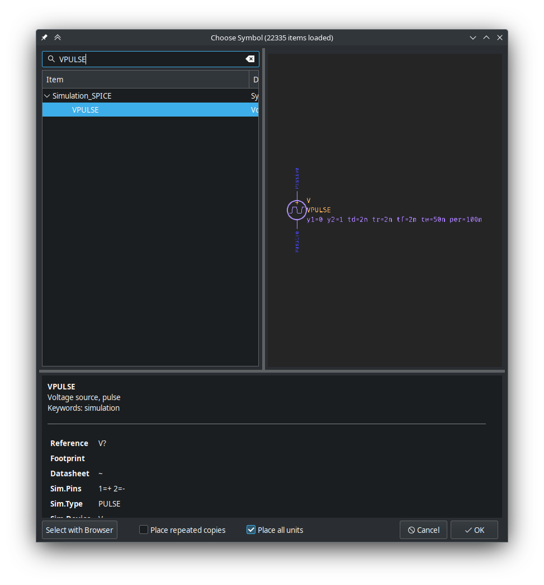</td>
		</tr>
	</tbody>
</table>


Now we need to set up the `VDC` and `VPULSE` symbols appropriately.

Hit `V` on the `VDC` symbol to edit it's value, we want it to be `1.8` volts rather than `1` volt, which is the default.

The setup for the `VPULSE` is a little more complicated, as we need to directly edit the simulation parameters, you can do this by hitting `p` on the symbol to bring up the properties, and then clicking the button labeled `Simulation Model...`:

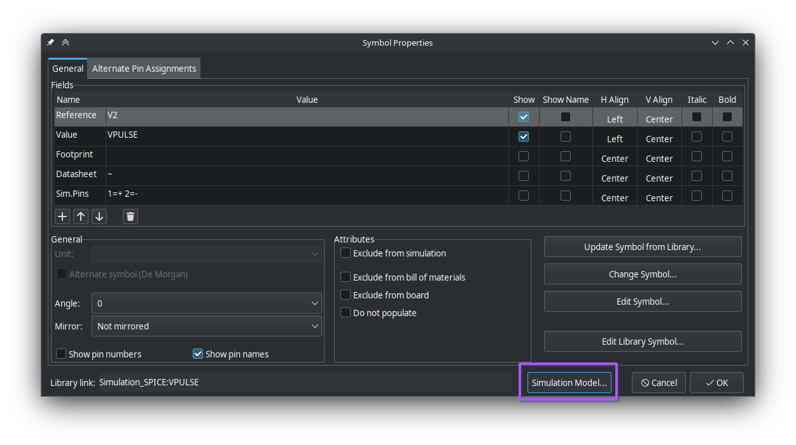

Now, this window is kinda scary and confusing, but we only are interested in 6 of the properties here; Pulsed Value, Delay, Rise time, Fall time, Pulse width, and Period.

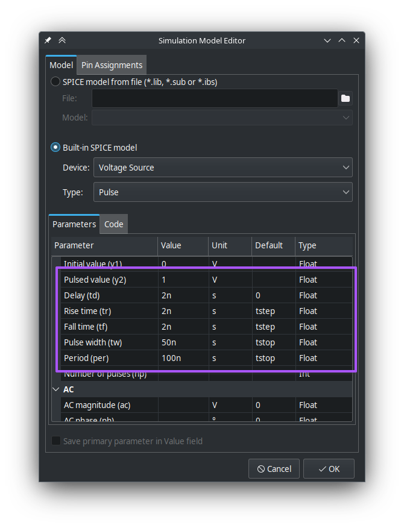

We want to set the following values:

| Parameter Name | Value  |
|----------------|--------|
| `Pulsed value` | `1.8`  |
| `Delay`        | `0`    |
| `Rise time`    | `2.5n` |
| `Fall time`    | `2.5n` |
| `Pulse width`  | `20n`  |
| `Period`       | `50n`  |

You can also do this by setting the `Sim.Params` setting in the raw symbol properties to `y1=0 y2=1.8 td=0 tr=2.5n tf=2.5n tw=20n per=50n`

Now we need to hook them up, with `VDC` you just need to put `VCC` up on the positive supply pin, and `GND` on the bottom one, with `VPULSE`, place a wire that is connected to our `A` net on the top, and `GND` on the bottom.

## Simulation Setup

We're almost there! We just need to do two more minor things.

The first being ensuring we have the proper SPICE directives set up so our simulation runs properly and can also fine all the needed model files for the sky130 FETs.


Add two text items to your schematic, one for each line of the following SPICE directives:

```spice
.tran 100f 100n
.lib ${PDK_ROOT}/sky130A/libs.tech/ngspice/sky130.lib.spice tt
```

The first line, `.tran 100f 100n` tells `ngspice` (the SPICE engine KiCad uses) to set up a transient simulation with a time step of `100` femtoseconds that lasts `100` nanoseconds.

The next line which starts with `.lib` is the path to the root sky130 simulation model library, and the argument `tt` tells it to use the "typical-typical" process corner for it's simulation.


You may be wondering what `${PDK_ROOT}` is in the `.lib` line, well, that's the second thing we need to set up, it's a text variable in eeschema that points to the ROOT of our PDK, you set it up by going into the `File -> Schematic Settings` dialog, and then under `Project` you can stick the path to your PDK root into `Text Variables`.

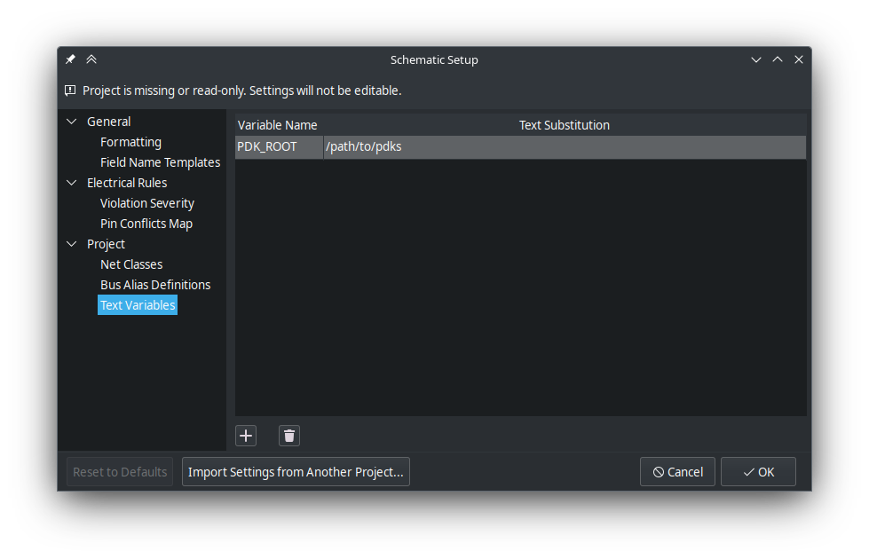


## Running the Simulation

And with that done, your whole schematic should look something like this, and be ready to simulate!

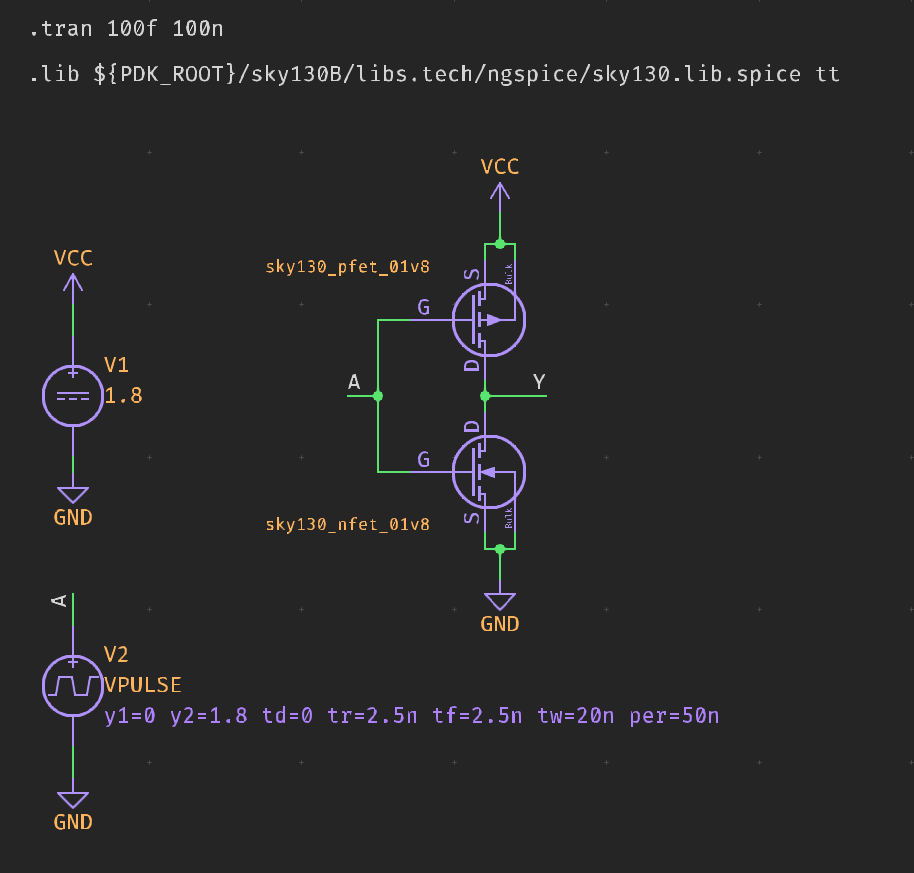


To start the simulation, we need to launch the KiCad SPICE simulator, to do so, simply click on the icon in the eeschema toolbar that looks like an oscilloscope waveform.

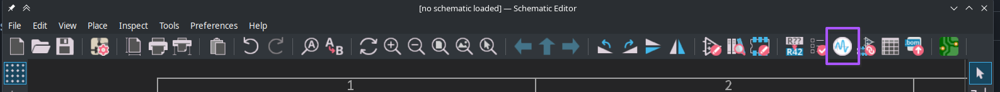


When done, an empty simulation window will open, and then you can just go ahead and click on the `Run/Stop Simulation` button, as we should be all set up for KiCad to just start the simulation

> ![IMPORTANT]
> Depending on your system, as well as a myrad of other factors the simulation might take a bit.

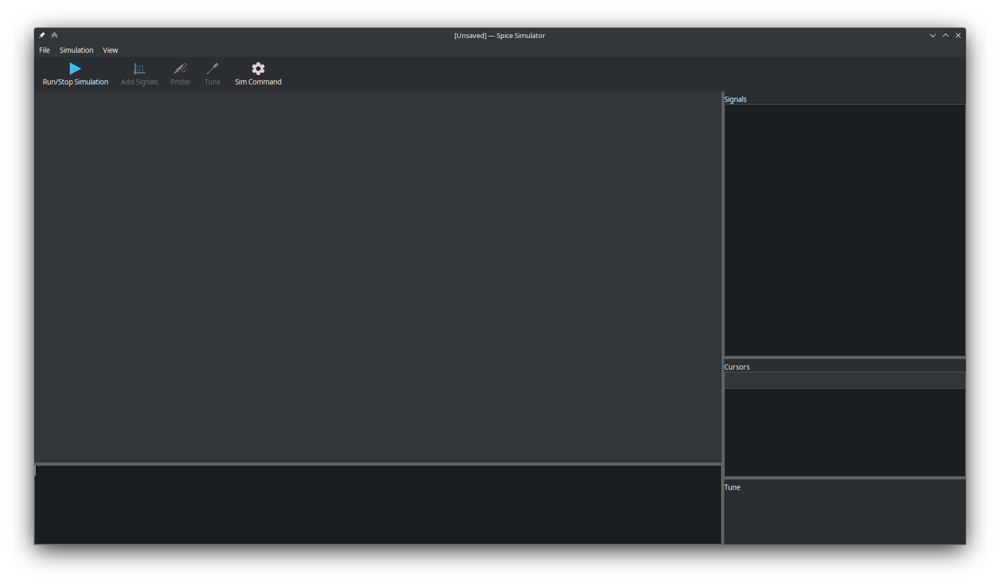

After a little while, and some text scrolling in the log, the simulation will be completed and you'll be presented with an empty plot. This may seem like the simulation didn't work, but we just have yet to add the signals we want to look at.

To do that, hit the `Add Signals` button which should now be enabled, and pick the `V(/A)` and `V(/Y)` signals from the list. (you can hold the ctrl key to select multiple). Once you hit `OK` you should be greeted with the plot of the inverter you just simulated!

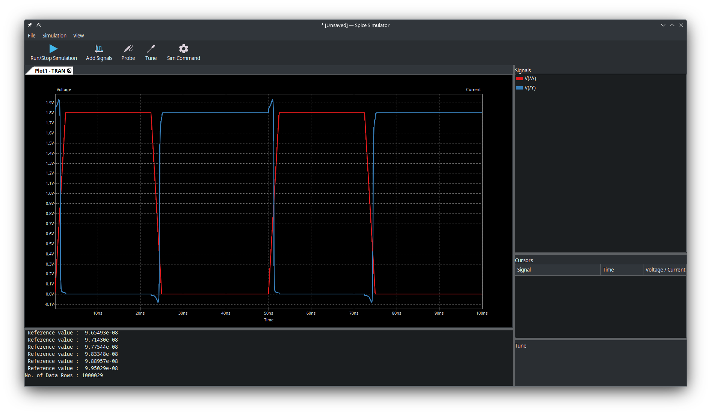


And that's it! you've just simulated a simple CMOS inverted in KiCad based on the sky130 process model!
